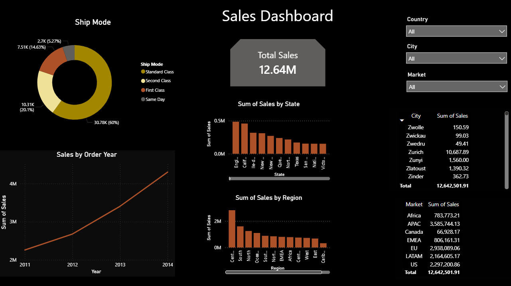

# Sales Dashboard - Power BI

## 📊 Project Overview
Interactive sales dashboard analyzing 4 years of Superstore data from 2011-2014.

## 🔍 Key Insights
- **Standard Class** represents 60% of all shipments  
- **APAC and EU** are the top 2 markets, generating over 60% of total sales  
- **Total Sales**: 12.64M over 4 years with steady growth from 2011 to 2014

## 🛠️ Tools Used
- Power BI Desktop
- DAX for calculations
- Data Visualization & Data Modeling

## 📸 Dashboard Preview

## 📂 Files
- `Sales_Dashboard.pbix` → Open this file with Power BI Desktop to explore interactively
- `Dashboard_Screenshot.png` → Preview image of the dashboard
